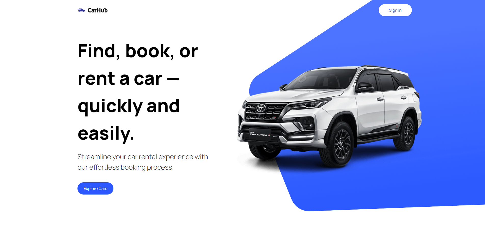

<a name="readme-top"></a>

# Build and Deploy a Modern Next.js 13 Application | React, Next JS 13, TypeScript, Tailwind CSS

This application was developed using [this YouTube guide](https://www.youtube.com/watch?app=desktop&v=pUNSHPyVryU).

The video guides you how to build a state-of-the-art modern application that leverages all of the latest and greatest of what Next 13 has to offer, leveraging features such as server-side rendering and the app router. 

Alongside building this application, you'll also learn how to:
- Use Next.js 13 App Router and Server Side Rendering
- Implement Advanced Search Functionality
- Create Filtering Capabilities
- Optimize Metadata and SEO
- Create custom filter, combobox, and modal elements
- Maintain a well-organized file and folder structure.
- Embrace the principles of writing clean code.
<br />


<!-- Live Demo Application -->
## Demo Application on Vercel
<h4>
<a href="https://next-carhub-app.vercel.app/">View it on Vercel</a>
</h4>

<!-- TechStack -->
## Tech Stack


<p align="right">(<a href="#readme-top">back to top</a>)</p>

<!-- Getting Started -->
## Getting Started

Clone the repository:

```bash
git clone https://github.com/sujoy-saha/next-carhub-app.git
cd next-carhub-app
```

Get all the dependencies:

```bash
npm install
```

Set-up configuration:

Create a `.env.local` in the root directory and add the following configuration details.

```bash
NEXT_RAPID_API_KEY = "Replace with your Rapid API Key"
NEXT_RAPID_API_HOST = "Replace with your Rapid API Host"
NEXT_RAPID_API_END_POINT =  "Replace with your Rapid API Endpoint"

NEXT_PUBLIC_IMAGIN_API_KEY = "Replace with your Imagin API Key"
NEXT_PUBLIC_IMAGIN_END_POINT = "Replace with your Imagin Endpoint"
```

Run the development server:

```bash
npm run dev
```

Open [http://localhost:3000](http://localhost:3000) with your browser to see the result.

You can start editing the page by modifying `app/page.tsx`. The page auto-updates as you edit the file.

This project uses [`next/font`](https://nextjs.org/docs/basic-features/font-optimization) to automatically optimize and load Inter, a custom Google Font.

<!-- Learn More -->
## Learn More

To learn more about Next.js, take a look at the following resources:

- [Next.js Documentation](https://nextjs.org/docs) - learn about Next.js features and API.
- [Learn Next.js](https://nextjs.org/learn) - an interactive Next.js tutorial.

You can check out [the Next.js GitHub repository](https://github.com/vercel/next.js/) - your feedback and contributions are welcome!

<!-- Deploye on Verce -->
## Deploy on Vercel

The easiest way to deploy your Next.js app is to use the [Vercel Platform](https://vercel.com/new?utm_medium=default-template&filter=next.js&utm_source=create-next-app&utm_campaign=create-next-app-readme) from the creators of Next.js.

Check out our [Next.js deployment documentation](https://nextjs.org/docs/deployment) for more details.

<!-- Acknowledgments -->
## Acknowledgements

This section used to mention useful resources and libraries that used in CreativAI Webapp:
- [Next.js](https://nextjs.org/)
- [TypeScript](https://www.typescriptlang.org/)
- [React.js](https://reactjs.org/)
- [Tailwind CSS](https://tailwindcss.com/)
- [Headless UI](https://headlessui.com/)
- [JS Mastery](https://www.jsmastery.pro/)

<p align="right">(<a href="#readme-top">back to top</a>)</p>
